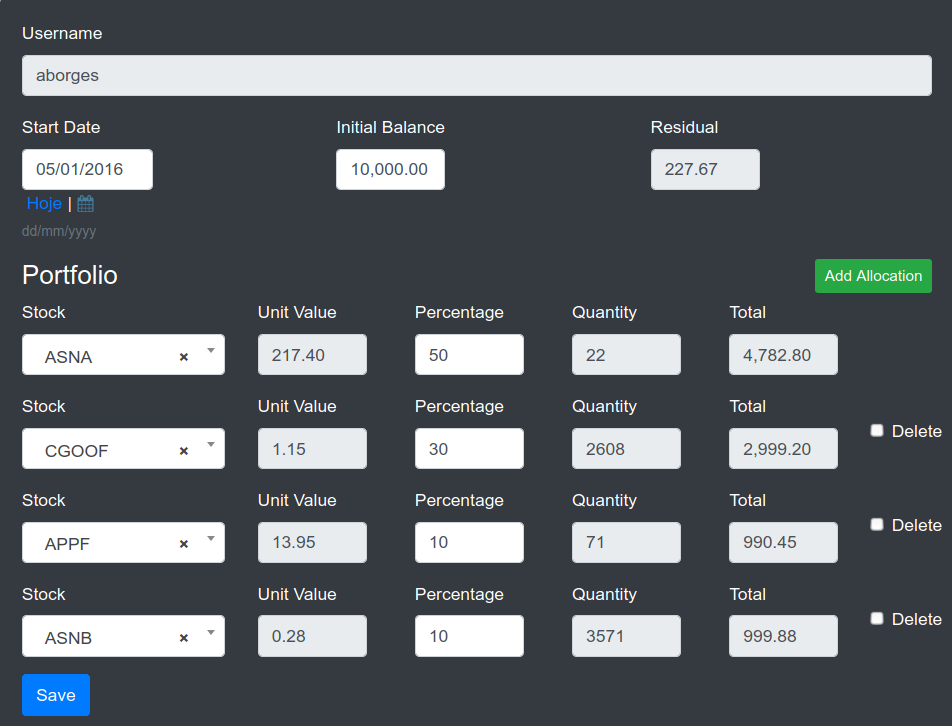
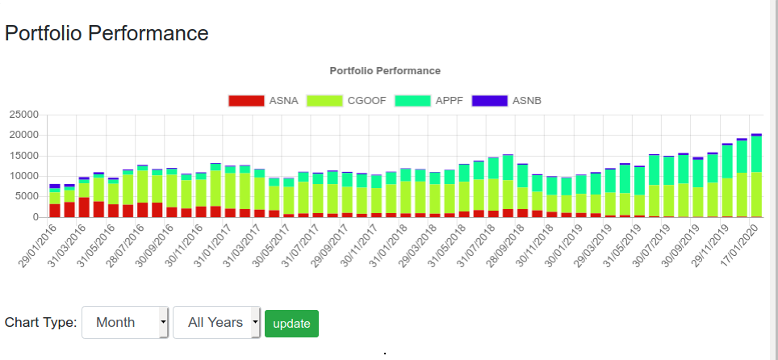
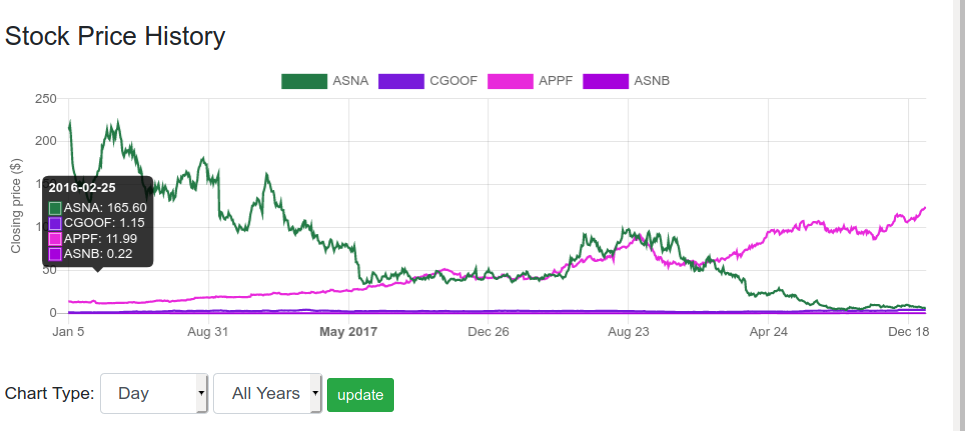

Portfolio Performance
=================

This application shows the evolution of a portfolio stock during the time. The values of the quotations are get from this [free api](https://www.worldtradingdata.com/). The charts are builded using the [chartjs library](https://www.chartjs.org).
   
## Building

It is needed the python3 library installed.

It is best to use the python `virtualenv` tool to build locally:

```sh
$ sudo apt-get install python3.6
$ sudo apt-get install virtualenv
$ sudo apt-get install python3-pip
$ virtualenv venv -p python3
$ source venv/bin/activate
$ pip3 install -r requirements.txt
$ python manage.py runserver
```

Then visit `http://localhost:8000` to view the app. 

## Screenshots





